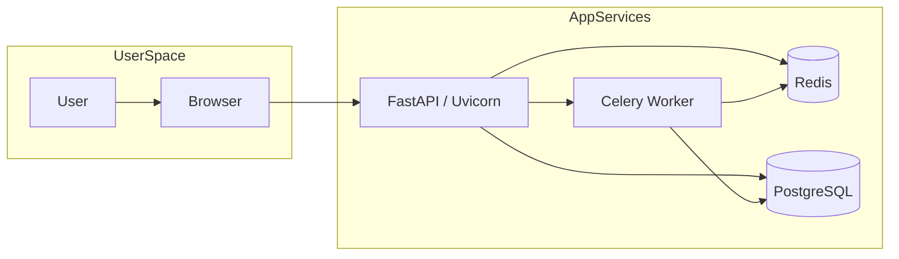
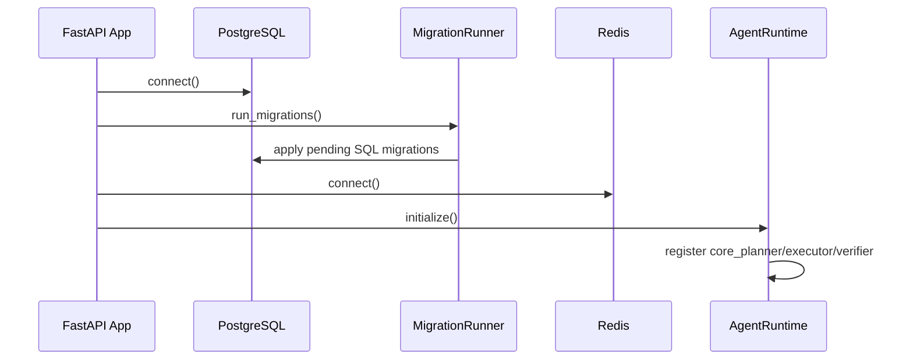
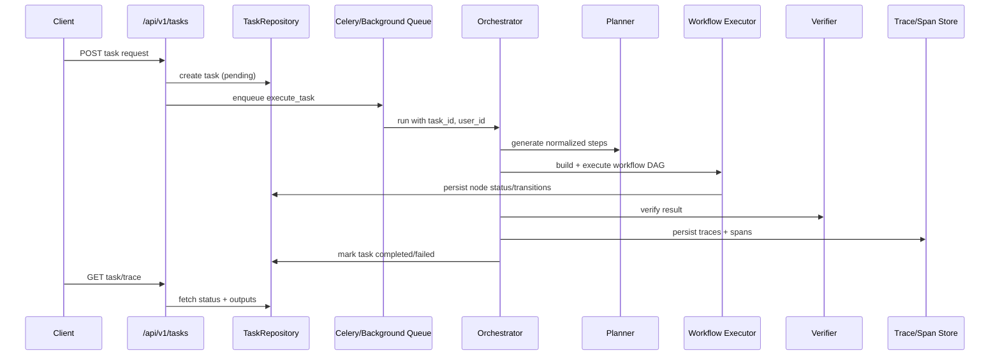
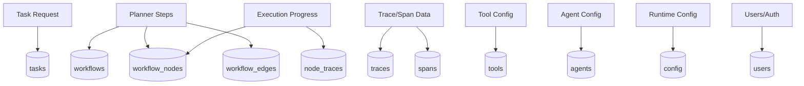
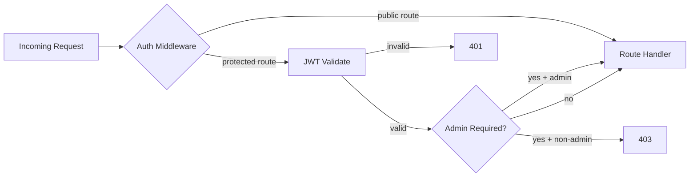

# Agent-OS Technical Documentation

Agent-OS is a multi-agent execution platform built around FastAPI, Celery, PostgreSQL, Redis, and a React control plane.

## 1. Purpose and Scope

Agent-OS provides:
- authenticated task submission and retrieval APIs,
- planner/executor/verifier agent orchestration,
- persisted workflow DAG execution state,
- runtime tool registry and custom tool execution,
- observability (metrics, traces, node-level execution records).

Primary implementation roots:
- `./app`
- `./frontend`

## 2. System Architecture

### 2.1 Logical Architecture Diagram

```mermaid
flowchart TB
    Client[Web Browser / API Client] --> Frontend[React Frontend]
    Frontend --> APIGW[FastAPI API Layer]

    APIGW --> Middleware[Auth + Rate Limit Middleware]
    APIGW --> Orchestrator[Orchestrator Core]

    Orchestrator --> Modes[Mode Strategies
(task/workflow/autonomous/collaboration)]
    Modes --> Runtime[AgentRuntime Singleton]
    Runtime --> Planner[Planner Agent]
    Runtime --> Executor[Executor Agent]
    Runtime --> Verifier[Verifier Agent]

    Executor --> Tools[Tool Registry + Sandbox]
    Modes --> MCP[MCP Protocol / Router / Bus]

    APIGW --> Repos[Repository Layer]
    Repos --> Postgres[(PostgreSQL)]
    Middleware --> Redis[(Redis)]
    Orchestrator --> Redis
    Orchestrator --> Tracing[Tracing + Metrics]
    Tracing --> Postgres

    CeleryWorker[Celery Worker] --> Orchestrator
    CeleryWorker --> Redis
```

### 2.2 Deployment Topology Diagram



### 2.3 Startup Dependency Order



## 3. Backend Execution Model

### 3.1 End-to-End Task Lifecycle



### 3.2 Mode Strategies
- `task`: plan -> execute -> verify pipeline.
- `workflow`: workflow semantics + optional predefined workflow name lookup.
- `autonomous`: iterative plan/execute loops with completion checks.
- `collaboration`: agent-type routing + MCP message dispatch.

### 3.3 Workflow DAG Semantics
- Graph validation rejects missing dependencies and cycles.
- Deterministic condition expressions only (no lambda execution).
- Skipped upstream nodes can still satisfy downstream dependency checks.
- Node status and trace linkage are persisted for replay/debugging.

## 4. API Contract Summary

Base API: `/api/v1`

- **Auth**: `POST /auth/signup`, `POST /auth/login`
- **Tasks**: `POST /tasks`, `GET /tasks`, `GET /tasks/{task_id}`, `DELETE /tasks/{task_id}`, `GET /tasks/{task_id}/trace`
- **Tools**: `GET /tools`, `GET /tools/{tool_name}`, `POST /tools`, `POST /tools/{tool_name}/execute`
- **Agents**: `GET /agents`, `GET /agents/{agent_id}`, `POST /agents`, `PUT /agents/{agent_id}`, `DELETE /agents/{agent_id}`
- **Config**: `GET /config`, `GET /config/{key}`, `POST /config`, `POST /config/reset`

Health/ops:
- `/health` (root)
- `/health`, `/health/ready`, `/health/live`, `/health/metrics`
- FastAPI docs/openapi endpoints are disabled in `app/main.py` (`docs_url=None`, `redoc_url=None`, `openapi_url=None`)

## 5. Data Model and Persistence

### 5.1 Persistence Domains
- Core tasking: `tasks`, `steps`, `workflows`, `workflow_nodes`, `workflow_edges`
- Messaging/context: `context`, `messages`
- Observability: `traces`, `node_traces`, `spans`
- Control planes: `tools`, `agents`, `config`, `users`

### 5.2 Data Path Diagram



Repositories in `app/memory/long_term.py` provide async CRUD/upsert access.

## 6. Security Architecture

- JWT bearer auth enforced by route dependency (`get_current_user`) and optional API auth middleware when `API_KEYS` is configured.
- Signup/login endpoints exempt from bearer requirement.
- Admin role required for config writes, tool registration, and agent mutations.
- Rate limiting middleware uses Redis sorted sets by user/IP.
- Password hashing uses bcrypt with SHA-256 preprocessing for long inputs.



## 7. Configuration Model

Primary settings source: `app/config/settings.py`.

Required:
- `DATABASE_URL`
- `REDIS_URL`
- `OPENAI_API_KEY`

Key runtime parameters:
- `OPENAI_MODEL`, `USE_CELERY`, `MAX_STEPS_DEFAULT`, `TIMEOUT_DEFAULT`, `MAX_RETRIES`
- `RATE_LIMIT_PER_MINUTE`, `MAX_ACTIVE_TASKS_PER_USER`, `MAX_TASK_EXECUTION_ATTEMPTS`
- `SECRET_KEY`, `ALGORITHM`, `ACCESS_TOKEN_EXPIRE_MINUTES`

## 8. Observability and Operations

### 8.1 Telemetry Components
- Structured logger (`app/logs/logger.py`)
- Prometheus text metrics collector (`app/logs/metrics.py`)
- Span/trace lifecycle manager (`app/logs/tracing.py`)

### 8.2 Observability Flow

```mermaid
flowchart LR
    Request[API / Worker Event] --> Span[Create Span]
    Span --> Persist[(traces/spans/node_traces)]
    Request --> Metrics[Increment Metrics]
    Metrics --> Endpoint[/health/metrics]
    Persist --> TraceAPI[/tasks/:id/trace]
```

### 8.3 Failure Modes and Recovery
- Planner/agent/tool errors are captured as task failures and persisted.
- Celery worker retries execution using configured retry limits/backoff.
- Graph validation failures terminate workflow early with explicit error context.

## 9. Frontend Technical Overview

- React Router protected routes with auth context token lifecycle handling.
- API client centralizes typed fetch calls and auth-expiry event propagation.
- Main pages: Dashboard, Agent Builder, Tool Registry, Orchestrator, Monitor, Settings.
- Build/test/lint stack: Vite + TypeScript + Vitest + ESLint.

## 10. Local Development and Operations

### 10.1 Backend
- `pytest -q`

### 10.2 Frontend
- `npm run dev`
- `npm run lint`
- `npm run test`
- `npm run build`
- `npm run preview`

### 10.3 Docker Stack
`docker/docker-compose.yml` provisions:
- PostgreSQL 16
- Redis 7
- API container
- Celery worker container

## 11. Repository Documentation Map

Every directory contains a technical `README.md` documenting module purpose, interfaces, and operational notes.
