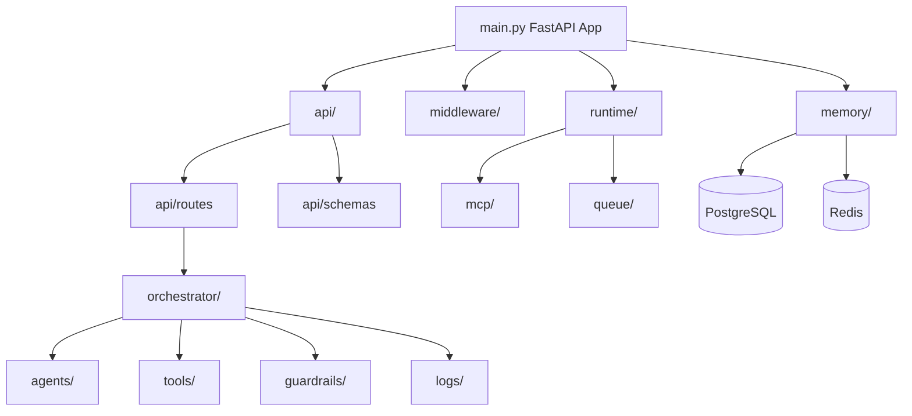

# app/ Backend Technical Documentation

## Purpose
Python backend package implementing API, orchestration, runtime, persistence, tooling, and observability.

## Backend Component Architecture

## Entry Point
- `main.py`: FastAPI application lifecycle, middleware, exception handling, and route mounting.

## Subsystem Map
- `api/`: route composition and request-layer contracts.
- `agents/`: planner/executor/verifier implementations.
- `runtime/`: agent worker lifecycle and singleton runtime.
- `orchestrator/`: mode strategies and workflow pipeline.
- `memory/`: database and redis state access.
- `tools/`: built-in/dynamic tool execution.
- `mcp/`: message protocol and routing.
- `queue/`: Celery worker execution hook.
- `middleware/`: auth and rate limiting.
- `guardrails/`: validation checks.
- `logs/`: metrics and tracing support.
- `config/`: settings model.
- `migrations/`: migration runner.

## Runtime Invariants
- Orchestrator delegates agent execution through `AgentRuntime` workers.
- Startup requires DB/Redis/OpenAI config to pass validation.
- Workflow graph persistence is treated as source of truth for execution progress.

## Operational Notes
- With `USE_CELERY=true`, task execution runs in worker processes.
- Without Celery, FastAPI background tasks run orchestration in-process.
