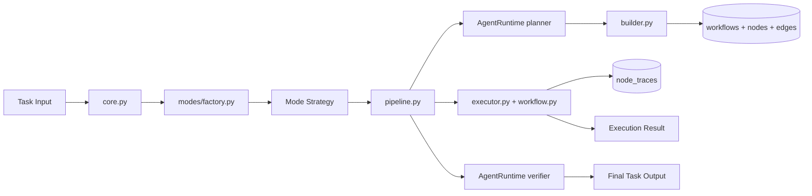

# app/orchestrator/ Technical Documentation

## Purpose
Implements task orchestration, workflow execution, retries, and mode strategies.

## Pipeline Architecture

## Core Modules
- `core.py`: orchestrator facade and mode dispatch.
- `pipeline.py`: plan -> workflow build -> graph execute -> verify pipeline.
- `workflow.py`: DAG model/validation/condition evaluation/execution.
- `builder.py`: workflow persistence from planner steps.
- `executor.py`: persisted step execution + node trace generation.
- `retry.py`: retry config and backoff logic.
- `context.py`: per-task runtime context container.
- `errors.py`: domain error codes/types.

## Workflow Execution Semantics
- Planner output is normalized before persistence.
- Graph dependencies are validated before node execution.
- Node statuses are persisted and trace-linked.
- Condition expressions are deterministic and constrained.

## Retry Model
- Retry decisions rely on retry configuration and current attempt counts.
- Worker-level failures can trigger Celery retry behavior with backoff.

## Extension Surface
Additional modes plug in through `modes/` strategy interface.
