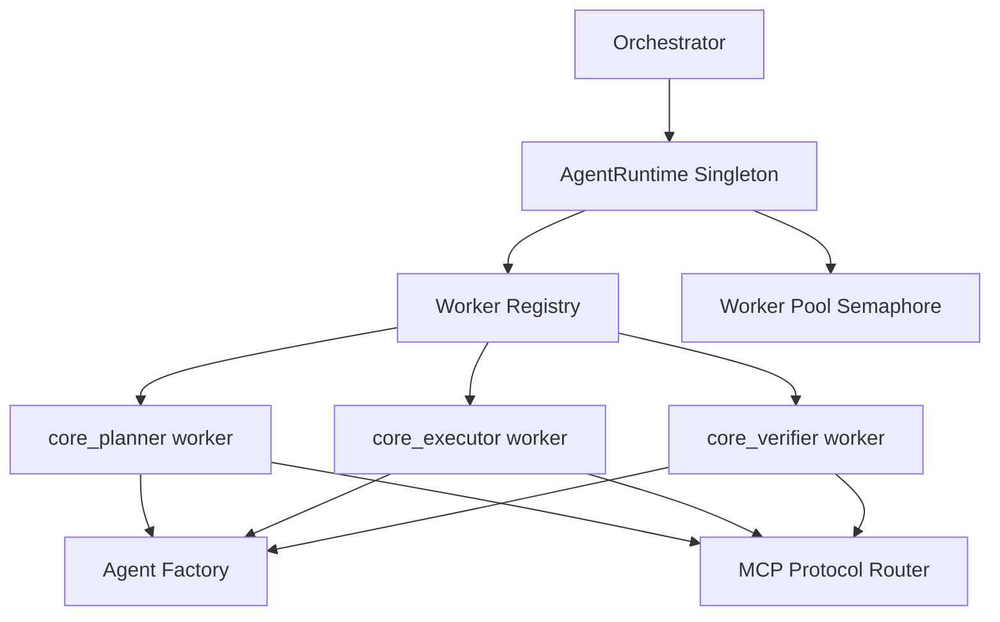

# app/runtime/ Technical Documentation

## Purpose
Runtime control plane for agent worker registration and execution lifecycle.

## Runtime Topology

## Modules
- `runtime.py`: singleton `AgentRuntime` worker registry and lifecycle APIs.
- `factory.py`: maps role/type to concrete agent implementation.
- `worker.py`: queue-driven worker inbox and direct execute wrapper.
- `pool.py`: semaphore-based worker capacity control.

## Architectural Constraint
`AgentRuntime` is the intended execution entry point for orchestrator-agent interactions.

## Startup Behavior
`initialize()` eagerly registers core agents:
- `core_planner`
- `core_executor`
- `core_verifier`

## Concurrency and Backpressure
- Pool semaphore caps active worker executions.
- Worker queue/inbox model allows async message-driven collaboration.
- Runtime `register()` binds each worker to MCP router receive handlers.
