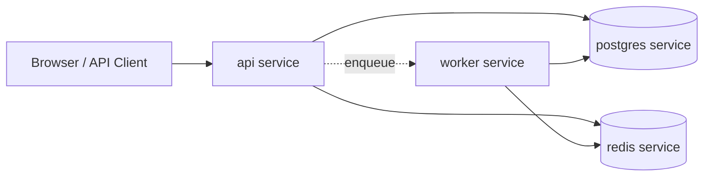

# docker/ Technical Documentation

## Purpose
Container images and service orchestration for local/dev runtime.

## Container Topology

## Files
- `Dockerfile`: Python runtime image for API and worker processes.
- `docker-compose.yml`: multi-service composition (postgres, redis, api, worker).

## Service Topology
- `postgres`: persistent relational store
- `redis`: cache, broker/backend, rate-limit storage
- `api`: FastAPI application (`uvicorn`)
- `worker`: Celery worker process

## Environment Contracts
API and worker require shared DB/Redis/OpenAI environment values.

## Operational Notes
- API and worker must run against the same database and Redis instance.
- Startup ordering should ensure data services are reachable before app workloads.
