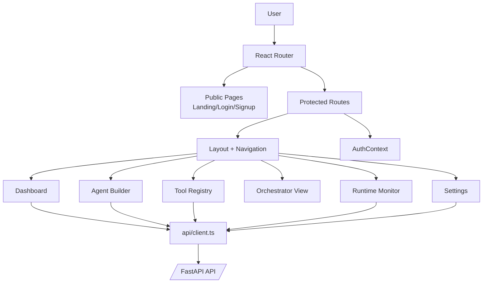
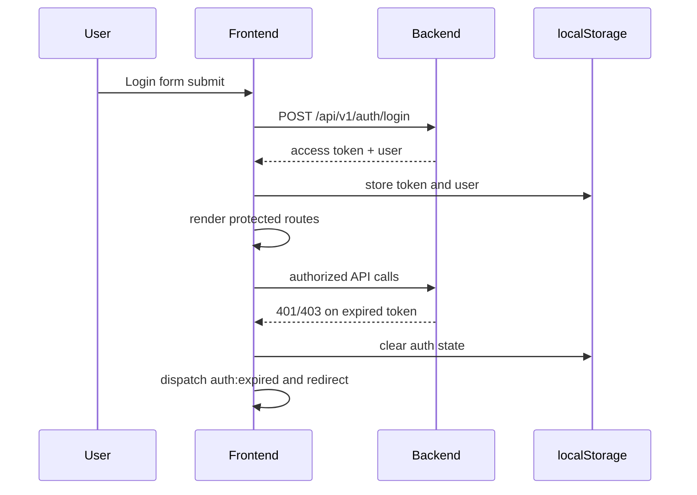

# frontend/ Technical Documentation

## Purpose
React control plane for interacting with Agent-OS backend APIs.

## Frontend Architecture Diagram

## Technology Stack
- React 19 + TypeScript
- React Router 7
- Vite 8
- Tailwind CSS + custom design utilities
- Vitest + Testing Library
- ESLint + TypeScript ESLint

## Application Architecture
- App shell and protected routing in `src/App.tsx`.
- Auth state management in `src/context/AuthContext.tsx`.
- HTTP integration in `src/api/client.ts`.
- Feature pages in `src/pages/*`.

## Auth and Session Lifecycle

## Main UI Domains
- Task execution and traces (`Dashboard`).
- Tool registry (`Tools`).
- Agent configuration (`AgentBuilder`).
- Runtime monitor (`Monitor`).
- Mode/agent visibility (`Orchestrator`).
- Runtime config management (`Settings`).

## Scripts
- `npm run dev`
- `npm run lint`
- `npm run test`
- `npm run build`
- `npm run preview`
