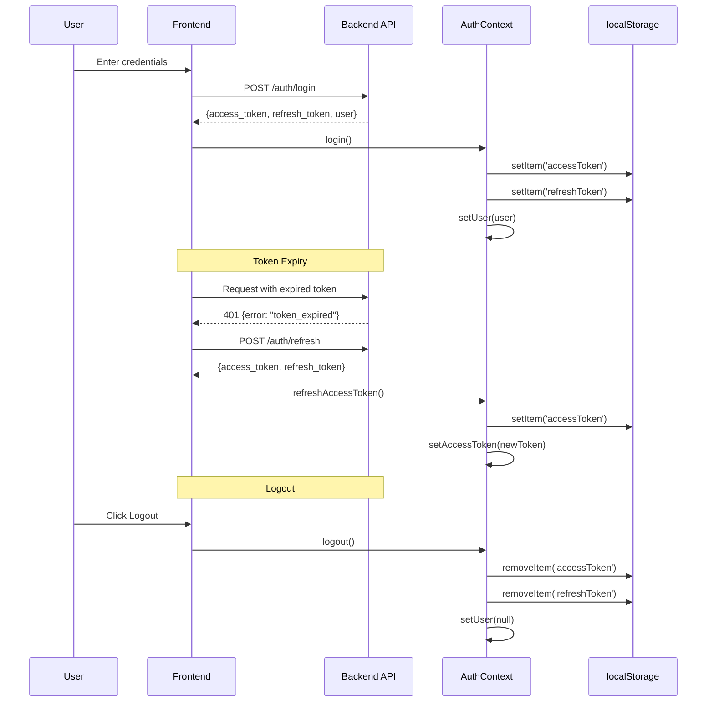
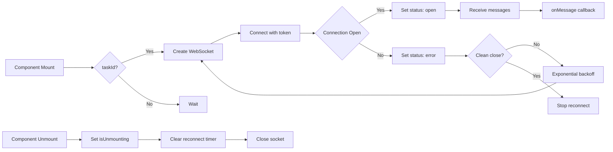

# AgentOS Frontend

> React 19 + TypeScript + Vite application for the AgentOS Agent Operating System.

## Architecture

The frontend is a single-page application (SPA) that communicates with the AgentOS backend via REST API and WebSocket connections.

```mermaid
graph TB
    subgraph "Frontend Architecture"
        APP[App.tsx<br/>Router + Layout]
        AUTH[AuthContext.tsx<br/>JWT + Refresh]
        API[api/client.ts<br/>Auto-refresh Client]
        WS[hooks/useWebSocket.ts<br/>Reconnect Logic]

        subgraph "Pages"
            DASH[Dashboard.tsx<br/>Task Submission + Metrics]
            AB[AgentBuilder.tsx<br/>Agent CRUD]
            WB[WorkflowBuilder.tsx<br/>DAG Editor]
            TOOLS[Tools.tsx<br/>Tool Registry]
            CHAT[Chat.tsx<br/>Conversational Interface]
            LOGIN[Login.tsx<br/>Authentication]
            SIGNUP[Signup.tsx<br/>Registration]
        end

        subgraph "Components"
            LAYOUT[Layout.tsx<br/>Navigation + Sidebar]
            TOAST[ToastProvider.tsx<br/>Notifications]
            ONBOARD[OnboardingModal.tsx<br/>First-time Tour]
            QUICK[QuickStartPanel.tsx<br/>Preset Tasks]
            HELP[HelpWidget.tsx<br/>Contextual Help]
        end
    end

    subgraph "Backend API"
        REST[FastAPI REST<br/>/api/v1]
        WS_API[WebSocket<br/>/ws/tasks/{id}]
    end

    APP --> LAYOUT
    APP --> AUTH
    AUTH --> API
    AUTH --> WS
    API --> REST
    WS --> WS_API
    DASH --> API
    DASH --> WS
    CHAT --> API
    AB --> API
    WB --> API
    TOOLS --> API
    LOGIN --> AUTH
    SIGNUP --> AUTH
    APP --> ONBOARD
    APP --> HELP
    DASH --> QUICK
    APP --> TOAST
```

## Tech Stack

| Component | Technology | Purpose |
|-----------|-----------|---------|
| Framework | React 19 | UI library |
| Language | TypeScript | Type safety |
| Build Tool | Vite 8 | Dev server & bundling |
| Styling | Tailwind CSS | Utility-first CSS |
| Routing | React Router DOM | Client-side routing |
| Icons | Lucide React | Icon library |
| Onboarding | Shepherd.js | Product tours |
| State | React Context | Auth state management |
| HTTP | Fetch API | REST API calls |
| WebSocket | Native WebSocket | Real-time events |

## Authentication Flow



## WebSocket Architecture

The `useWebSocket` hook provides stable WebSocket connections with exponential backoff reconnect logic:



### Reconnect Behavior

| Scenario | Behavior |
|----------|----------|
| Unexpected close (code != 1000) | Reconnect with exponential backoff (max 30s) |
| Clean close (code 1000) | No reconnect |
| Error | Set status to 'error', trigger reconnect |
| Unmount | Cancel all timers, close socket, prevent reconnect |

## Project Structure

```
frontend/src/
├── api/
│   └── client.ts              # ApiClient with auto-refresh on 401
├── context/
│   └── AuthContext.tsx        # AuthProvider + useAuth hook
├── hooks/
│   └── useWebSocket.ts        # WebSocket hook with reconnect
├── pages/
│   ├── Dashboard.tsx          # Main dashboard with task submission
│   ├── AgentBuilder.tsx       # Agent creation and management
│   ├── AgentBuilderV2.tsx     # Enhanced agent builder v2
│   ├── WorkflowBuilder.tsx    # Workflow DAG editor
│   ├── WorkflowBuilderV2.tsx  # Enhanced workflow builder v2
│   ├── Tools.tsx              # Tool registry browser
│   ├── Chat.tsx               # Conversational interface
│   ├── Login.tsx              # Login page
│   ├── Signup.tsx             # Registration page
│   ├── Landing.tsx            # Marketing landing page
│   ├── Monitor.tsx            # System monitoring
│   ├── Settings.tsx           # User settings
│   ├── Providers.tsx          # LLM provider management
│   ├── KnowledgeBase.tsx      # Knowledge base management
│   ├── Deployments.tsx        # Workflow deployments
│   ├── APIKeys.tsx            # API key management
│   └── Orchestrator.tsx       # Orchestrator view
├── components/
│   ├── Layout.tsx             # App shell with navigation
│   ├── ToastProvider.tsx      # Toast notification system
│   ├── CursorGlow.tsx         # Visual effect component
│   ├── EmptyState.tsx         # Empty state placeholder
│   ├── OnboardingModal.tsx    # Onboarding step modal
│   ├── QuickStartPanel.tsx    # Preset task cards
│   ├── ui/                    # Reusable UI components
│   │   ├── StatusBadge.tsx
│   │   ├── AnimatedNumber.tsx
│   │   └── Skeleton.tsx
│   └── Onboarding/
│       ├── TourProvider.tsx   # Shepherd.js tour wrapper
│       ├── tourSteps.ts       # Tour step definitions
│       ├── HelpWidget.tsx     # Floating help widget
│       └── index.ts           # Barrel export
├── App.tsx                    # Root component with routes
├── main.tsx                   # Entry point
└── test/
    └── setup.ts               # Test configuration
```

## Key Components

### AuthContext

Manages authentication state across the application:
- Stores `accessToken`, `refreshToken`, and `user` in `localStorage`
- Provides `login()`, `signup()`, `logout()`, `refreshAccessToken()` methods
- Monitors token expiry every 60 seconds
- Dispatches `auth:expired` event on token expiry
- Syncs auth state across tabs via `storage` event listener

### ApiClient

Centralized API client with automatic token refresh:
- Injects `Authorization: Bearer` header on all requests
- Auto-refreshes on 401 with `error: "token_expired"`
- Retries failed requests after successful refresh
- Dispatches `auth:expired` event if refresh fails

### useWebSocket

Stable WebSocket hook for real-time task events:
- Automatic reconnection with exponential backoff
- Ping/pong keepalive (30s timeout)
- Cleanup on unmount to prevent orphan sockets
- Token-based authentication via query parameter

### TourProvider

Shepherd.js integration for user onboarding:
- Conditional rendering based on `localStorage` flags
- Step-by-step tours for Dashboard and Agent Builder
- Skip/Next navigation with modal overlay
- Auto-starts after 500ms delay for DOM readiness

## Setup

```bash
cd frontend
npm install
npm run dev
```

The development server starts on `http://localhost:5173`.

### Environment Variables

Create a `.env` file in the `frontend` directory:

```env
VITE_API_URL=http://localhost:8000/api/v1
VITE_WS_URL=ws://localhost:8000
```

## Build

```bash
npm run build
```

The production build is output to `frontend/dist/`.

## Testing

```bash
npm run test
```

## Linting

```bash
npm run lint
```

## API Integration

### Creating a Task

```typescript
import { apiClient } from './api/client';

const response = await apiClient.createTask({
  query: 'Research the latest AI trends',
  mode: 'task',
  config: { max_steps: 10, timeout: 300 }
});
console.log(response.task_id);
```

### Listening to Task Events

```typescript
import { useWebSocket } from './hooks/useWebSocket';

function TaskMonitor({ taskId }: { taskId: string }) {
  const { messages, status } = useWebSocket({
    taskId,
    onMessage: (data) => {
      console.log('Event:', data);
    }
  });

  return (
    <div>
      <p>Status: {status}</p>
      <ul>
        {messages.map((msg, i) => (
          <li key={i}>{JSON.stringify(msg)}</li>
        ))}
      </ul>
    </div>
  );
}
```

### Using Auth Context

```typescript
import { useAuth } from './context/AuthContext';

function Profile() {
  const { user, isAuthenticated, logout } = useAuth();

  if (!isAuthenticated) return <p>Please log in</p>;

  return (
    <div>
      <p>Welcome, {user?.name}</p>
      <button onClick={logout}>Logout</button>
    </div>
  );
}
```

## Troubleshooting

### WebSocket connection fails
- Verify `VITE_WS_URL` is correct
- Check that the backend is running
- Ensure the access token is valid and not expired

### 401 Unauthorized errors
- The API client should auto-refresh tokens
- If refresh fails, the user is logged out automatically
- Check `auth:expired` event handling

### CORS errors
- Verify `CORS_ORIGINS` in backend `.env` includes `http://localhost:5173`
- Ensure the backend is running on the expected port

### Build fails
- Ensure all dependencies are installed: `npm install`
- Check TypeScript version compatibility
- Verify `vite.config.ts` is correctly configured
